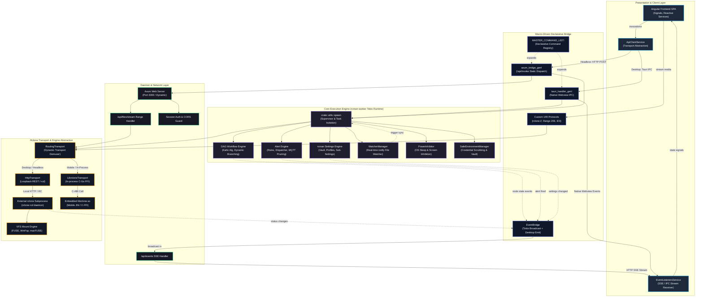

# Rclone Manager System Architecture

> **Document Status**: Production Architecture Specification  
> **Target Audiences**: Core Maintainers, System Engineers, Contributors  
> **Applicable Versions**: v2.0+ (Tauri v2, Headless Axum Daemon, rcman)

---

## 1. System Overview & Dual-Engine Paradigm

### 1.1 The Storage & Sync Orchestrator: Headless-First Philosophy
Traditional cloud storage clients typically follow a monolithic desktop model: a GUI thread tightly coupled to an internal transfer loop. This pattern fails under modern DevOps, NAS, home-lab, and multi-tenant environments where storage operations must persist independently of an active user desktop session.

`rclone-manager` is fundamentally architected not as a simple desktop frontend, but as an autonomous, distributed **Storage & Sync Orchestrator**. The user interface is an ephemeral consumer of a resilient underlying daemon.

```
┌────────────────────────────────────────────────────────────────────────┐
│                        Rclone Manager Ecosystem                        │
└────────────────────────────────────────────────────────────────────────┘
                 │                                        │
      ┌──────────▼──────────┐                  ┌──────────▼──────────┐
      │ Desktop GUI Mode    │                  │ Headless Daemon Mode│
      │ (Tauri v2 + Wry)    │                  │ (Axum Server / SSE) │
      └──────────┬──────────┘                  └──────────┬──────────┘
                 │                                        │
                 │         Unified Declarative Bridge     │
                 └───────────────────┬────────────────────┘
                                     │
                         ┌───────────▼───────────┐
                         │   Tokio Core Engine   │
                         │   (rcman + Scheduler) │
                         └───────────┬───────────┘
                                     │
                 ┌───────────────────┴────────────────────┐
                 │                                        │
      ┌──────────▼──────────┐                  ┌──────────▼──────────┐
      │ Subprocess Daemon   │                  │ In-Process FFI      │
      │ (rclone rcd over RC)│                  │ (librclone C-Go)    │
      └─────────────────────┘                  └─────────────────────┘
```

#### Architectural Rationale
1. **Lifecycle Decoupling**: File synchronization, scheduled backups, continuous directory watchers, and VFS mounts must continue uninterrupted when the user closes the window, logs out of the desktop session, or reboots into headless server mode.
2. **Resource Footprint Adaptability**: By enabling headless mode via feature flags (`web-server`), the binary strips all GUI windowing libraries (WebKitGTK, Cocoa, WebView2), reducing runtime RAM consumption from ~120 MB down to <25 MB on embedded Linux and Docker environments.
3. **Multi-Client Topology**: The headless daemon acts as a central storage gateway, allowing multiple web browsers, mobile instances, and external automation scripts to interface with a single persistent storage controller over authenticated REST and Server-Sent Events (SSE).

### 1.2 Unified Single-Codebase Strategy
Rather than maintaining divergent codebases for desktop and server editions, `rclone-manager` leverages Rust’s conditional compilation (`#[cfg(...)]`) and Angular’s platform-agnostic service layer to produce targeted binaries from a single repository:

| Target Platform | GUI Context | IPC / Transport Layer | Engine Subsystem |
| :--- | :--- | :--- | :--- |
| **Desktop** (Linux, Windows, macOS) | Tauri v2 (`Wry`) | Native OS Webview IPC | Subprocess (`rclone rcd`) |
| **Headless Linux Daemon** (Servers, Docker) | *None* (Headless) | Axum HTTP (`/invoke`) + SSE (`/events`) | Subprocess (`rclone rcd`) |
| **Mobile** (Android, iOS) | Tauri v2 Mobile Webview | Native IPC / SAF Bridge | Embedded C-Go (`librclone` FFI) |

On the frontend, Angular abstracts platform communication via [`ApiClientService`](https://github.com/Zarestia-Dev/rclone-manager/blob/main/src/app/services/infrastructure/platform/api-client.service.ts) and [`TauriBaseService`](https://github.com/Zarestia-Dev/rclone-manager/blob/main/src/app/services/infrastructure/platform/tauri-base.service.ts). If `window.__TAURI_INTERNALS__` is detected, invocations are routed to Tauri’s native IPC. If absent, calls automatically divert to HTTP REST endpoints without a single line of component code needing branch logic.

---

## 2. Declarative Bridge & Macro-Driven Metaprogramming

### 2.1 The Problem: Bridge Duplication & RPC Drift
In dual-runtime applications (Desktop IPC vs. Web Server REST), developers typically maintain two parallel routing tables:
1. Tauri's `invoke_handler` registration macro.
2. Axum/Actix HTTP route handlers deserializing JSON bodies.

This dual-registration inevitably causes runtime drift, mismatched parameter signatures, broken type safety, and boilerplate maintenance for hundreds of commands.

### 2.2 Compile-Time Unification: `MASTER_COMMAND_LIST!`
To eliminate this entire class of bugs, `rclone-manager` implements a declarative macro pattern in [`src-tauri/src/core/commands.rs`](https://github.com/Zarestia-Dev/rclone-manager/blob/main/src-tauri/src/core/commands.rs). All application commands are declared exactly once inside `MASTER_COMMAND_LIST!`:

```rust
MASTER_COMMAND_LIST! {
    // Format: (bridge_command_name, rust_function_path, [args...], [execution_flags...])
    (get_fs_info, $crate::rclone::queries::get_fs_info, [remote: String, path: Option<String>]);
    (load_settings, $crate::core::settings::operations::core::load_settings, []);
    (get_build_type, $crate::utils::app::platform::get_build_type, [], [sync, no_app, infallible]);
}
```

This macro acts as an abstract AST that can be expanded by different consumer macros depending on the compilation profile.

```
                    ┌───────────────────────────────┐
                    │     MASTER_COMMAND_LIST!      │
                    │   (Single Source of Truth)    │
                    └───────────────┬───────────────┘
                                    │
            ┌───────────────────────┴───────────────────────┐
            │                                               │
   (Desktop Builds)                                (Web Server Builds)
            │                                               │
┌───────────▼───────────┐                       ┌───────────▼───────────┐
│  tauri_handler_gen!   │                       │    axum_bridge_gen!   │
└───────────┬───────────┘                       └───────────┬───────────┘
            │                                               │
            ▼                                               ▼
tauri::generate_handler![...]                 pub async fn bridge_dispatch(...)
(Zero-cost native IPC dispatch)               (Strictly-typed Axum JSON dispatcher)
```

### 2.3 Zero-Cost Static Dispatch vs. Dynamic Trait Objects
Dynamic dispatch via trait objects (`Box<dyn Fn(Value) -> Future<...>>`) introduces runtime heap allocation, vtable pointer indirection, and strips the compiler’s ability to inline argument parsing.

`MASTER_COMMAND_LIST!` uses pure compile-time static dispatch:
- **Tauri Target**: Expands directly into `tauri::generate_handler![path1, path2, ...]`.
- **Axum Target**: Expands into an asynchronous string match statement (`bridge_dispatch`) where each match arm creates an ephemeral, strictly-typed `struct Args { $($arg: $typ),* }` annotated with `#[derive(Deserialize)]`. The compiler performs dead-code elimination, inlines deserialization, and produces a direct branch table.

### 2.4 Variadic Signature Unification via `call_internal!`
Rust does not natively support variadic function signatures. Different backend commands require different invocation contexts:
- Pure queries need no UI state: `fn(args) -> Result<T, E>`
- UI actions need Tauri state: `fn(AppHandle, args) -> Result<T, E>`
- Lightweight queries are synchronous: `fn() -> T`
- Heavy I/O is asynchronous: `async fn(...) -> Result<T, E>`

The `call_internal!` helper macro matches declarative execution tags (`sync`, `no_app`, `infallible`) and bridges them seamlessly into a uniform asynchronous execution pipeline:

```rust
#[macro_export]
macro_rules! call_internal {
    // 1. Synchronous, No AppHandle
    ($path:path, $app:expr, $args:expr, [$($arg:ident),*], [sync, no_app]) => {
        $path($($args.$arg),*).map_err(|e| e.to_string())?
    };
    // 2. Synchronous with AppHandle
    ($path:path, $app:expr, $args:expr, [$($arg:ident),*], [sync]) => {
        $path($app.clone(), $($args.$arg),*).map_err(|e| e.to_string())?
    };
    // 3. Asynchronous, No AppHandle
    ($path:path, $app:expr, $args:expr, [$($arg:ident),*], [no_app]) => {
        $path($($args.$arg),*).await.map_err(|e| e.to_string())?
    };
    // 4. Asynchronous with AppHandle (Standard Default)
    ($path:path, $app:expr, $args:expr, [$($arg:ident),*], []) => {
        $path($app.clone(), $($args.$arg),*).await.map_err(|e| e.to_string())?
    };
    // 5. Infallible (Returns raw value directly without Result wrapping)
    ($path:path, $app:expr, $args:expr, [$($arg:ident),*], [sync, no_app, infallible]) => {
        $path($($args.$arg),*)
    };
}
```

### 2.5 Simplified Macro Architecture Demonstration

```rust
// Simplified structural representation of commands.rs
#[macro_export]
macro_rules! MASTER_COMMAND_LIST {
    ($action:ident) => {
        $action! {
            (get_fs_info, $crate::rclone::queries::get_fs_info, [remote: String, path: Option<String>]);
            (load_settings, $crate::core::settings::operations::core::load_settings, []);
            #[cfg(not(feature = "web-server"))]
            (open_in_files, $crate::utils::io::file_helper::open_in_files, [path: std::path::PathBuf]);
            (get_build_type, $crate::utils::app::platform::get_build_type, [], [sync, no_app, infallible]);
        }
    };
}

// 1. Tauri invoke registration generator
#[macro_export]
macro_rules! tauri_handler_gen {
    ($( $(#[$meta:meta])? ($name:ident, $path:path, [$($arg:ident : $typ:ty),*] $(, [$($tag:ident),*])?) );* $(;)?) => {
        tauri::generate_handler![
            $( $(#[$meta])? $path ),*
        ]
    };
}

// 2. Axum Bridge Dispatch generator
#[cfg(feature = "web-server")]
macro_rules! axum_bridge_gen {
    ($( $(#[$meta:meta])? ($name:ident, $path:path, [$($arg:ident : $typ:ty),*] $(, [$($tag:ident),*])?) );* $(;)?) => {
        pub async fn bridge_dispatch(
            app: &tauri::AppHandle,
            command: &str,
            payload: serde_json::Value
        ) -> Result<serde_json::Value, String> {
            match command {
                $(
                    $(#[$meta])?
                    stringify!($name) => {
                        #[derive(serde::Deserialize)]
                        #[serde(rename_all = "camelCase")]
                        struct Args { $($arg: $typ),* }
                        let args: Args = serde_json::from_value(payload).map_err(|e| e.to_string())?;
                        let res = $crate::call_internal!($path, app, args, [$($arg),*], [$($($tag),*)?]);
                        Ok(serde_json::to_value(res).map_err(|e| e.to_string())?)
                    }
                )*
                _ => Err(format!("Command '{command}' not recognized by bridge"))
            }
        }
    };
}
```

---

## 3. Runtime Isolation & Concurrency Model

### 3.1 UI Event Loop vs. Asynchronous I/O Isolation
A common anti-pattern in desktop UI engineering is performing I/O or background waiting on threads managed by the GUI framework. In Tauri (WebKitGTK on Linux, WebView2 on Windows), blocking the main OS thread causes instantaneous frame drops, unresponsiveness, and OS "force kill" dialogs.

`rclone-manager` strictly isolates the GUI runtime from the asynchronous execution engine:
- **Main Thread**: Dedicated solely to OS event pump processing, native window events, system tray interactions, and WebKit message passing.
- **Dedicated Tokio Runtime**: An independent, multi-threaded Tokio runtime (`rcman-worker`) is instantiated inside `main.rs` before Tauri is booted. All file transfers, network I/O, alert evaluations, and subprocess monitoring run on this runtime.

```
┌───────────────────────────────────────────────────────────────┐
│                      OS Main Thread                           │
│  - Tauri Event Loop (RunEvent)                                │
│  - Window Management & Native Tray                            │
│  - WebKitGTK / WebView2 Message Pump                          │
└───────────────────────────────┬───────────────────────────────┘
                                │ Non-blocking IPC / Bridge
                                ▼
┌───────────────────────────────────────────────────────────────┐
│             Tokio Worker Runtime (rcman-worker)               │
│                                                               │
│   ┌─────────────────────┐          ┌──────────────────────┐   │
│   │ Subsystem Task Pool │          │ Automation Watchers  │   │
│   │ (Sync, Mount, VFS)  │          │ (Notify IO Events)   │   │
│   └─────────────────────┘          └──────────────────────┘   │
│   ┌─────────────────────┐          ┌──────────────────────┐   │
│   │ Axum Server Engine  │          │ Alert Action Router  │   │
│   │ (HTTP + SSE Stream) │          │ (MQTT, Webhooks, OS) │   │
│   └─────────────────────┘          └──────────────────────┘   │
└───────────────────────────────────────────────────────────────┘
```

### 3.2 The `crate::utils::spawn` Standard
Calling `tokio::spawn` directly in production Tauri code is dangerous: calling it outside of an established Tokio worker context (such as inside Tauri setup hooks, window close listeners, or OS tray menu callbacks) causes an immediate panic:
`"there is no reactor running"`.

To guarantee resilience, all background tasks must be spawned through [`crate::utils::spawn`](https://github.com/Zarestia-Dev/rclone-manager/blob/main/src-tauri/src/utils/process/task.rs):

```rust
static RUNTIME_HANDLE: OnceLock<tokio::runtime::Handle> = OnceLock::new();

pub fn spawn<F>(future: F) -> JoinHandle<F::Output>
where
    F: Future + Send + 'static,
    F::Output: Send + 'static,
{
    runtime_handle().spawn(future)
}
```

`runtime_handle()` dynamically extracts the active runtime handle or falls back to a lazily initialized global runtime pool, ensuring thread safety across any calling context.

### 3.3 Worker/Supervisor Pattern & Panic Resilience
File synchronization involves unpredictable external conditions: broken pipes, network timeouts, invalid file descriptors, or corrupt SQLite databases.

To prevent an error in a single transfer job from crashing the entire process:
1. **Task Isolation**: Long-running jobs run inside isolated Tokio `JoinHandle` boundaries.
2. **Cancellation Tokens**: Operations observe `tokio_util::sync::CancellationToken` hierarchies. If an operation is cancelled by the user or encounters a fatal unrecoverable condition, only the child worker is dropped.
3. **Supervisor Health Monitors**: Subsystems (such as the Rclone engine process supervisor) run continuous health checks. If the underlying rclone daemon exits unexpectedly, the supervisor intercepts the exit code, broadcasts an `EngineStatus::Error` event, and attempts an automated clean restart without destabilizing the host process.

### 3.4 Decoupling from `AppHandle` towards `CoreContext`
Historically, desktop applications pass Tauri's `AppHandle` into every business logic function. However, `AppHandle` inherently carries windowing dependencies that complicate headless execution.

The architectural roadmap transitions state stores to an independent `CoreContext` pattern:
- Services depend only on `Arc<T>` managed state (e.g., `AppSettingsManager`, `BackendManager`, `EventBridge`).
- Windowing and system tray interactions are decoupled into peripheral listeners that observe state streams rather than driving them directly.

---

## 4. Event & Notification Dispatching Architecture

### 4.1 Unified Event Distribution: `EventBridge`
State modifications in `rclone-manager` are entirely event-driven. When a file transfer progresses, a remote is created, or a mount state changes, the core engine emits a structured domain event.

In [`src-tauri/src/core/bridge/event.rs`](https://github.com/Zarestia-Dev/rclone-manager/blob/main/src-tauri/src/core/bridge/event.rs), `EventBridge` provides a unified distribution bus across desktop and headless targets:

```
                  Backend State Mutation
                            │
                            ▼
                   EventBridge::emit(...)
                            │
            ┌───────────────┴───────────────┐
            ▼                               ▼
    (Desktop Target)               (Headless Target)
            │                               │
     tauri::App::emit               Tokio Broadcast
 (Native Webview IPC Bus)           (Capacity: 1000)
            │                               │
            ▼                               ▼
   Tauri Event Listener              Axum SSE Handler
   (Desktop Webview)                (/api/events Stream)
```

```rust
pub fn emit<S: Serialize + Clone>(&self, event: &str, payload: S) {
    let value = serde_json::to_value(&payload).unwrap_or(serde_json::Value::Null);
    let bridge_event = BridgeEvent {
        event: event.to_string(),
        payload: value,
    };

    // 1. Broadcast to Tokio channel (consumed by web-server SSE clients)
    let _ = self.tx.send(bridge_event);

    // 2. Forward to desktop webview IPC if running in desktop mode
    #[cfg(not(feature = "web-server"))]
    {
        if let Some(ref app) = *self.app_handle.read() {
            use tauri::Emitter;
            let _ = app.emit(event, payload);
        }
    }
}
```

### 4.2 Frontend Reactive Parity
On the Angular frontend, [`EventListenersService`](https://github.com/Zarestia-Dev/rclone-manager/blob/main/src/app/services/infrastructure/system/event-listeners.service.ts) abstracts the transport:
- In **Desktop Mode**, it attaches native Tauri event listeners.
- In **Headless Mode**, it connects an `EventSource` to `/api/events` and demuxes incoming payloads into the exact same RxJS Subjects.

UI components subscribe to strongly-typed Observables and Signals without knowing whether they are connected via native IPC or HTTP Server-Sent Events.

### 4.3 Alert Rule Engine & Dynamic Resource Lifecycle Pruning
`rclone-manager` features an integrated Alert Engine ([`src-tauri/src/core/alerts`](https://github.com/Zarestia-Dev/rclone-manager/blob/main/src-tauri/src/core/alerts)) capable of evaluating triggers on job completions, transfer errors, bandwidth saturation, or disk space exhaustion, and firing downstream actions (OS Notifications, Webhooks, Telegram, or MQTT messages).

#### The Resource Leak Challenge
MQTT and HTTP Keep-Alive connections require long-lived TCP sockets and active event loops. If a user deletes an alert rule or edits its broker configuration, stale TCP connections and background reconnect loops will leak memory and network file descriptors if not explicitly terminated.

#### Dynamic Pruning Mechanism: `prune_unused_mqtt_connections`
Whenever alert rules or actions are modified, saved, or deleted, the system executes `prune_unused_mqtt_connections` in [`src-tauri/src/core/alerts/commands.rs`](https://github.com/Zarestia-Dev/rclone-manager/blob/main/src-tauri/src/core/alerts/commands.rs):

```rust
async fn prune_unused_mqtt_connections(app: &AppHandle) {
    let cache = app.state::<cache::AlertRuleCache>();
    let dispatch_ctx = app.state::<DispatchContext>();

    let rules = cache.get_rules().await;
    let actions = cache.get_actions().await;

    // 1. Collect all action IDs referenced by currently enabled rules
    let mut referenced_action_ids = HashSet::new();
    for rule in rules.iter().filter(|r| r.enabled) {
        referenced_action_ids.extend(rule.action_ids.iter().cloned());
    }

    // 2. Filter active MQTT actions
    let active_mqtt_action_ids: HashSet<String> = actions
        .iter()
        .filter_map(|action| match action {
            AlertAction::Mqtt(_)
                if action.is_enabled() && referenced_action_ids.contains(action.id()) =>
            {
                Some(action.id().to_string())
            }
            _ => None,
        })
        .collect();

    // 3. Prune sessions: Retain active ones, disconnect and drop unreferenced ones
    dispatch_ctx
        .mqtt_registry
        .prune_to_action_ids(&active_mqtt_action_ids)
        .await;
}
```

Inside [`MqttSessionRegistry::prune_to_action_ids`](https://github.com/Zarestia-Dev/rclone-manager/blob/main/src-tauri/src/core/alerts/dispatch/mqtt.rs), `sessions.retain(...)` evaluates active IDs. Dropping the session triggers `AsyncClient::disconnect` and terminates the underlying Tokio network event loop, guaranteeing deterministic resource deallocation.

---

## 5. Subsystems & Integration Ecosystem

### 5.1 `rcman` Crate Integration: Declarative Settings Engine
Settings management in `rclone-manager` is powered by [`rcman`](https://github.com/Zarestia-Dev/rcman), an independent, framework-agnostic configuration engine.

```
┌──────────────────────────────────────────────────────────────┐
│                    rcman Settings Engine                     │
├──────────────────────────────────────────────────────────────┤
│  Schema Layer    : #[derive(DeriveSettingsSchema)]           │
│  Secret Vault    : Argon2id Key Derivation + AES-256-GCM     │
│  Persistence     : Atomic File Swaps (tempfile -> rename)    │
│  Sub-Settings    : Isolated domains (remotes, alerts, etc.)  │
│  Profiles        : Multi-profile configurations per remote   │
└──────────────────────────────┬───────────────────────────────┘
                               │
               3-Tier Credential Fallback Pipeline
                               │
        ┌──────────────────────┼──────────────────────┐
        ▼                      ▼                      ▼
  [Tier 1: OS Keychain] [Tier 2: Encrypted File] [Tier 3: In-Memory]
  - Secret Service (DBus) - AES-256-GCM Vault    - Ephemeral RAM
  - Windows DPAPI / Cred   - Master Password      - Fallback for headless
  - macOS Keychain          Protected             containers without DBus
```

#### Key Architecture Guarantees in `rclone-manager`:
1. **Deterministic Metadata Ordering**: `rcman` enforces `indexmap::IndexMap` across all schema metadata, guaranteeing consistent JSON serialization order and preventing erratic UI re-renders.
2. **3-Tier Credential Fallback**:
   - **Tier 1 (OS Keychain)**: Uses native secure enclaves via libsecret/D-Bus (Linux), Credential Manager (Windows), and Keychain (macOS).
   - **Tier 2 (Encrypted File Vault)**: In headless servers or Docker containers lacking a D-Bus session bus, `rcman` transparently falls back to an encrypted vault file secured with Argon2id and AES-256-GCM.
   - **Tier 3 (In-Memory)**: Non-persisted ephemeral storage for volatile test environments.
3. **Sub-Settings & Migration Pipelines**: Subsystems (remotes, alert rules, quick runs, workflows) are isolated into independent JSON storage blocks via `SubSettingsConfig`, each versioned with declarative schema migrators.

### 5.2 Process & Engine Abstraction: Subprocess vs. Embedded FFI
Interfacing with upstream Rclone requires flexibility across differing OS sandbox models. `rclone-manager` abstracts the execution mechanism behind the [`RcloneTransport`](https://github.com/Zarestia-Dev/rclone-manager/blob/main/src-tauri/src/rclone/backend/transport.rs) asynchronous trait:

```rust
#[async_trait]
pub trait RcloneTransport: Send + Sync {
    async fn kind(&self) -> TransportKind;
    async fn rpc(&self, endpoint: &str, payload: Option<&Value>) -> Result<Value, BackendError>;
    async fn rpc_with_timeout(&self, endpoint: &str, payload: Option<&Value>, timeout: Duration) -> Result<Value, BackendError>;
}
```

```
                     RcloneTransport Trait
                               │
            ┌──────────────────┴──────────────────┐
            ▼                                     ▼
     HttpTransport                       LibrcloneTransport
  (Desktop & Headless)                    (Mobile Targets)
            │                                     │
    Loopback HTTP POST                   C-Go FFI C-Call
(rclone rcd daemon on 127.0.0.1)        (RcloneRPC in librclone.so)
```

1. **`HttpTransport` (Desktop & Headless)**:
   - Spawns a supervised `rclone rcd` subprocess with randomized credentials over local loopback.
   - Communicates via persistent HTTP/1.1 connections with connection pooling and keep-alive.
   - Full support for VFS file mounting, external process monitoring, and dynamic bandwidth limiting.
2. **`LibrcloneTransport` (Mobile Targets - Android & iOS)**:
   - Mobile operating systems strictly prohibit arbitrary binary subprocess spawning.
   - The engine compiles upstream Rclone as a static C-Go archive (`librclone.a` / `librclone.so`).
   - Requests cross the FFI boundary via direct in-memory C strings (`RcloneRPC`), enabling complete Rclone functionality without spawning sub-processes.
3. **Dynamic `RoutingTransport`**:
   - Proxies calls dynamically between local instances, embedded engines, or external remote Rclone daemons registered in the backend connection manager.

---

## 6. Extended Architectural Pillars

### 6.1 Virtual Filesystem (VFS) & Mount Lifecycle Management
`rclone-manager` exposes a cross-platform virtual filesystem mounting subsystem supporting FUSE (Linux), WinFsp (Windows), and macFUSE (macOS).
- **VFS Cache Policies**: Automates granular configuration of `--vfs-cache-mode` (`off`, `minimal`, `writes`, `full`), writeback delays, and cache chunk sizing.
- **Graceful Unmount Interceptors**: Unmounting a busy filesystem can hang the OS kernel. The mount manager employs an aggressive teardown strategy: issuing an asynchronous `vfs/forget` RPC, attempting graceful unmount (`fusermount3 -u` / `umount`), and falling back to forced detached unmounts with comprehensive lock release on application shutdown.

### 6.2 Hardware & OS Power Management (`PowerInhibitor`)
Long-running multi-gigabyte cloud transfers and scheduled synchronizations must not be suspended by operating system power-saving policies.

The [`PowerInhibitor`](https://github.com/Zarestia-Dev/rclone-manager/blob/main/src-tauri/src/core/power) subsystem automatically registers system sleep inhibitors when transfers or active mounts are detected:
- **Linux**: Interacts via D-Bus with `org.freedesktop.ScreenSaver` and `org.freedesktop.PowerManagement.Inhibit`.
- **Windows**: Invokes `SetThreadExecutionState(ES_CONTINUOUS | ES_SYSTEM_REQUIRED)`.
- **macOS**: Allocates an `IOPMAssertionCreateWithName` power assertion.

When the transfer queue empties, the inhibitor releases its lock, restoring standard system power management without user intervention.

### 6.3 Reactive Real-Time Filesystem Watcher (`WatcherManager`)
Automated directory synchronization is powered by a high-performance filesystem watcher engine ([`src-tauri/src/core/automation/watcher.rs`](https://github.com/Zarestia-Dev/rclone-manager/blob/main/src-tauri/src/core/automation/watcher.rs)) built on the `notify` crate.
- **Event Debouncing**: Filesystem operations often fire massive bursts of events (e.g., recursive extraction, code compilation). The watcher employs a sliding debounce window (configurable between 500ms and 10s) to consolidate rapid events into distinct operation batches.
- **Bi-directional Coordination**: Watches exclude sync temporary files and remote download caches to avoid triggering infinite sync ping-pong loops.

### 6.4 Language-Agnostic Error Architecture (`localized_error!`)
To maximize backend throughput and minimize memory consumption on headless systems:
- **Zero Pre-Translation**: The Rust backend **never** loads multi-language string dictionaries. It does not parse or interpolate localized strings into error messages.
- **Structured Error Emission**: All backend errors are constructed using the `localized_error!` macro, outputting structured JSON containing a canonical localization key and typed parameters:
  ```json
  {
    "key": "backendErrors.mount.failedToMount",
    "params": { "remote": "gdrive", "error": "device busy" }
  }
  ```
- **Client-Side Resolution**: Angular’s `BackendTranslationService` receives the key, interpolates parameters, and resolves the string against its asset catalogs on demand. This keeps the Rust binary compact and ensures zero backend memory overhead for multi-language support.

### 6.5 Headless Network Security & Non-Secure Context Hardening
Exposing an orchestration daemon over a local network introduces specific attack vectors. `rclone-manager` implements defense-in-depth network hardening:
1. **Cookie-Based Session Tokens**: Headless interactions require authentication against cryptographically secure session tokens generated at startup.
2. **CORS & Origin Hardening**: The Axum HTTP bridge enforces strict Origin and Referer validation to prevent Cross-Site Request Forgery (CSRF) from unauthorized browser tabs.
3. **Non-Secure HTTP Compatibility**: Modern browsers disable the Web Crypto API (`crypto.randomUUID()`) in non-secure (plain HTTP over remote LAN IP) contexts. The frontend enforces a strict rule: **never call `crypto.randomUUID()` directly**. Instead, all UUIDs and random tokens are generated via [`generatePrefixedId`](https://github.com/Zarestia-Dev/rclone-manager/blob/main/src/app/shared/utils), ensuring flawless operation over private networks without requiring self-signed SSL certificates.

### 6.6 Visual Workflow Engine: Directed Acyclic Graph (DAG) Orchestration
Automation pipelines in `rclone-manager` are executed as true Directed Acyclic Graphs ([`src-tauri/src/core/flow/workflow/`](https://github.com/Zarestia-Dev/rclone-manager/blob/main/src-tauri/src/core/flow/workflow)):
- **Topological Sorting & Cycle Detection**: Before execution, graphs pass through Kahn's algorithm (`dag.rs`). Self-loops, indirect circular dependencies, and orphaned disconnected branches are detected at compile/validation time, preventing recursive deadlock.
- **Reactive Dependency-Driven Concurrent Branching**: Nodes whose in-degree reaches zero execute concurrently on separate Tokio green threads. As nodes finish, outputs (files, transfer summaries, error states) interpolate dynamically into downstream edge parameters.
- **Cascading Subprocess Cancellation**: Workflows maintain an `ActiveWorkflowState` containing an `Arc<AtomicBool>`, a `tokio::sync::watch` broadcast sender, and a registry of active Rclone job IDs. Triggering a workflow stop instantly terminates child transfers at the Rclone daemon level and drops active branches cleanly.
- **State Streaming**: Real-time status transitions (`WORKFLOW_EXECUTION_STATE_CHANGED`, `WORKFLOW_NODE_STATE_CHANGED`) stream continuously to the UI via `EventBridge`, providing live visual node-progress indicators.

### 6.7 High-Throughput Media Streaming & Zero-Copy Custom URI Protocols
Browsing cloud files requires instant playback of video, audio, and large documents without waiting for full gigabyte downloads.
- **Desktop Custom Protocols (`rclone://`, `asset://`, `audio-cover://`)**: In [`src-tauri/src/utils/app/protocol.rs`](https://github.com/Zarestia-Dev/rclone-manager/blob/main/src-tauri/src/utils/app/protocol.rs), custom asynchronous URI scheme protocols are registered directly into the Webview runtime. When a user streams media, the handler intercepts HTTP `Range` headers, proxies the requested byte slice directly from the cloud backend, and forwards it to the HTML5 `<video>` or `<audio>` player with zero disk caching.
- **Headless HTTP Range Handler**: In headless mode ([`src-tauri/src/server/handlers/files.rs`](https://github.com/Zarestia-Dev/rclone-manager/blob/main/src-tauri/src/server/handlers/files.rs)), `/api/files/stream` parses `Range: bytes=start-end` requests and streams partial chunks (`206 Partial Content`) via `tokio_util::io::ReaderStream`.
- **In-Memory Audio Cover Extraction**: ID3 and FLAC tags are parsed in-memory on the fly by probing the first few kilobytes of the remote file (`MAX_AUDIO_COVER_PROBE_BYTES`), extracting embedded JPEG/PNG artwork without downloading audio tracks.

### 6.8 Telemetry, Job Tracking & Dynamic Bandwidth Shaping
Transfer observability is managed through a centralized job tracker ([`src-tauri/src/rclone/commands/job.rs`](https://github.com/Zarestia-Dev/rclone-manager/blob/main/src-tauri/src/rclone/commands/job.rs)):
- **Structured Telemetry Ingestion**: The engine queries Rclone's `core/stats` endpoint and parses transfer metrics via `job_parser.rs` (instantaneous throughput, ETA, percentage, bytes transferred, and per-file progress arrays).
- **Parent-Child Hierarchies**: Multi-file batch uploads and workflow transfer blocks register parent job handles. If a child step fails, the parent orchestrator evaluates retry policies, partial successes, or group-wide rollbacks.
- **Dynamic Bandwidth Scheduling**: Bandwidth limits can be adjusted on the fly without interrupting transfers using the `bandwidth_limit` endpoint, supporting schedule-based traffic shaping (e.g., peak-hour throttles).

### 6.9 Security Architecture & Safe Environment Isolation
Because Rclone remotes may store sensitive OAuth refresh tokens, S3 access keys, and encryption passwords:
- **`SafeEnvironmentManager`**: Child processes and OS shell hooks execute in scrubbed process environments to prevent leaking `RCLONE_CONFIG_PASS` or authorization tokens to untrusted sub-processes.
- **Master Password Lifecycle**: When configuration encryption is enabled, master credentials are held in protected memory structures and zeroized upon application shutdown or session timeout.
- **Value Obscuring**: Passwords and secrets written to configuration profiles pass through Rclone’s obfuscation cipher (`rclone obscure`) before storage.

### 6.10 Operating System Integration & Single-Instance IPC
`rclone-manager` interfaces natively with desktop OS shells:
- **"Send To" / Context Menu Hooks**: Registers native shell extensions on Windows and `.desktop` action handlers on Linux to allow users to right-click local files and upload directly to any configured cloud remote.
- **Single-Instance IPC Deduplication**: If a secondary instance is launched (e.g., via a context menu or CLI invocation), the single-instance plugin intercepts the launch args, transfers the file payload over a local IPC socket / D-Bus bus to the primary running instance, and exits immediately.

---

## 7. Comprehensive Visual Architecture Diagram



---

## 8. Summary & Key Architectural Invariants

| Invariant | Enforcement Rule | Architectural Justification |
| :--- | :--- | :--- |
| **Zero Duplicate RPC Registration** | All commands declared exclusively in `MASTER_COMMAND_LIST!` | Guarantees exact API parity between desktop IPC and headless web-server REST without reflection overhead. |
| **No UI-Thread Blocking** | Background tasks spawned exclusively via `crate::utils::spawn` | Eliminates "no reactor running" panics and prevents WebKitGTK / WebView2 UI freezes. |
| **DAG Cycle Safety** | Kahn's algorithm validates node graphs prior to execution | Prevents infinite execution loops, branch deadlocks, and cascading task starvation. |
| **Zero-Disk Media Streaming** | Custom URI scheme / HTTP 206 Partial Content byte ranges | Enables seeking inside remote 4K videos and audio files without exhausting local disk space. |
| **Zero Backend String Translations** | Use `localized_error!` and `localized_success!` only | Keeps the Rust memory footprint <25 MB on headless servers; client renders localized text dynamically. |
| **Deterministic Resource Pruning** | Explicit connection lifecycle pruning (e.g., `prune_unused_mqtt_connections`) | Prevents network socket leaks and zombie background loops when automation rules change. |
| **Credential Bleed Prevention** | `SafeEnvironmentManager` scrubs subprocess environments | Prevents sensitive master passwords (`RCLONE_CONFIG_PASS`) from leaking into child hooks or logs. |
| **Non-Secure Context Hardening** | Use `generatePrefixedId`, avoid `crypto.randomUUID()` | Guarantees seamless operation over plain HTTP on LAN / NAS / Docker setups where Web Crypto is blocked. |
| **Transport Agnosticism** | Frontend uses `ApiClientService` / `TauriBaseService` | Components and business logic remain completely agnostic of whether they run in desktop Tauri or a remote web browser. |

