# [[icon:photo_library.primary]] Wiki Gallery

Explore the features and capabilities of **RClone Manager** through this visual gallery. The application is designed with a premium, GNOME-inspired user interface built using Angular and Tauri to deliver a native, highly responsive experience across desktop, headless web server, and mobile environments.

---

## [[icon:palette.primary]] Core Interface & Theme Support

RClone Manager features a state-of-the-art UI with deep integration for system color schemes, automatically switching between light and dark modes.

### Dark Mode (System Default)

The dark mode interface uses a tailored dark color palette to reduce eye strain, emphasizing clear hierarchy and subtle borders.

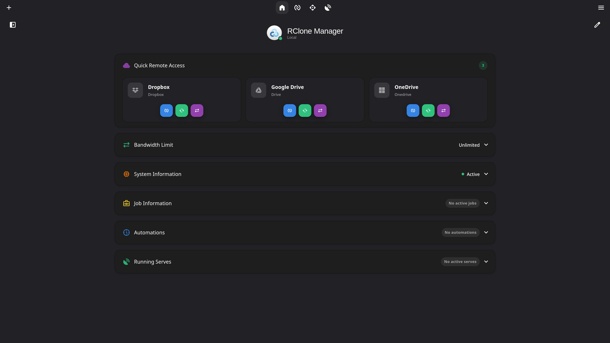

### Light Mode

The light mode interface offers a crisp, clean appearance with bright backgrounds and high-contrast typography.

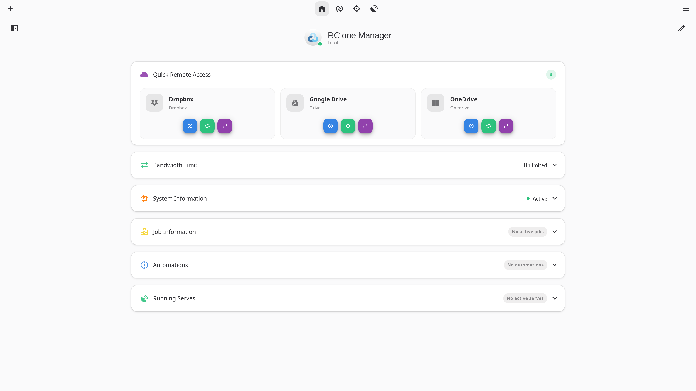

---

## [[icon:dashboard.primary]] Dashboard & Remote Management

Manage all your active configurations, cloud remotes, and system status metrics from centralized interfaces.

### General Home

The home screen serves as your control center. It displays active mounts, protocol servers, ongoing transfer jobs, and system metrics in a unified dashboard.

### Remote Overview

View and control all your configured Rclone cloud storage remotes (Google Drive, OneDrive, Dropbox, SFTP, etc.) with options for quick sync, directory browsing, and configuration updates.

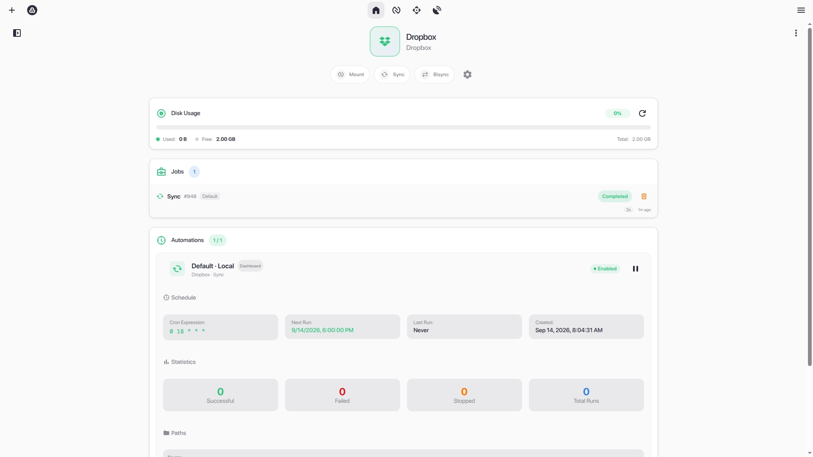

---

## [[icon:account_tree.primary]] Visual Workflow Automation

Design, schedule, and execute complex multi-step cloud automation pipelines using an intuitive node-based canvas editor.

### Visual Workflow Canvas

Connect triggers (manual, cron schedules, folder watchers, job finish events) to transfer tasks, branching condition logic, delay timers, parallel splits, and external notifications (Telegram, WhatsApp, Webhooks, Email, MQTT) with smooth Bezier cables.

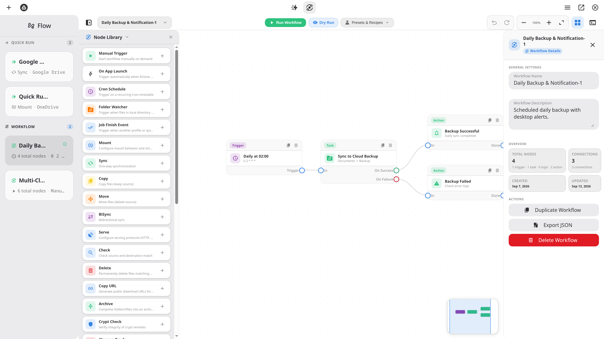

---

## [[icon:bolt.primary]] Quick Runs Workspace

Trigger ad-hoc cloud operations, manage custom command presets, and monitor execution states in a responsive card grid.

### Quick Runs Dashboard

Run sync, copy, move, check, mount, or serve operations with a single click. Cards feature real-time status badges, live transfer throughput, duration counters, and direct log inspection.

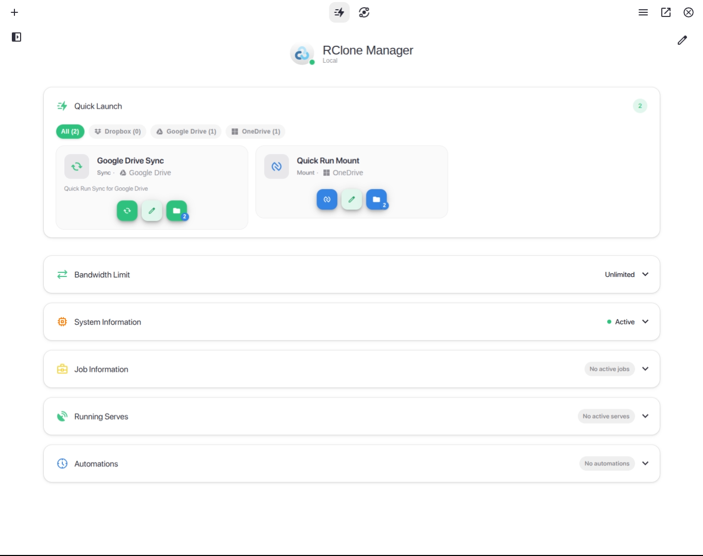

---

## [[icon:folder_open.primary]] Nautilus File Manager & File Viewer

Browse and interact with your cloud files exactly as you would on a local disk using the powerful built-in file explorer.

### Nautilus File Explorer

The custom **Nautilus** file explorer allows you to browse, edit, move, copy, rename, delete, and download files directly on your remotes. It supports batch actions and smooth drag-and-drop operations.

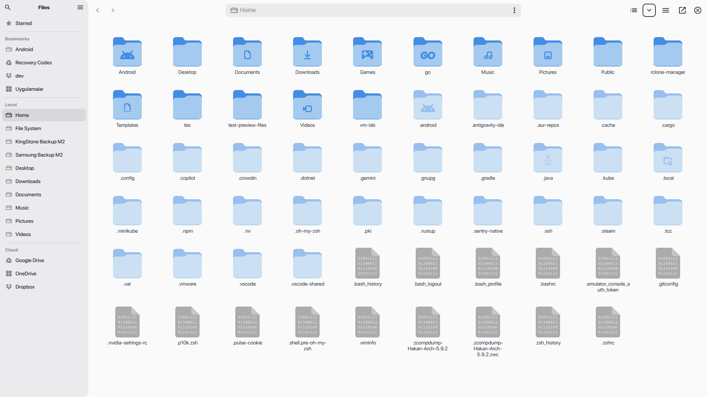

### Integrated File Viewer

Open and preview a wide range of file types directly within the application without needing external tools. Supports video streaming, audio playback, PDF viewing, markdown rendering, and text editing.

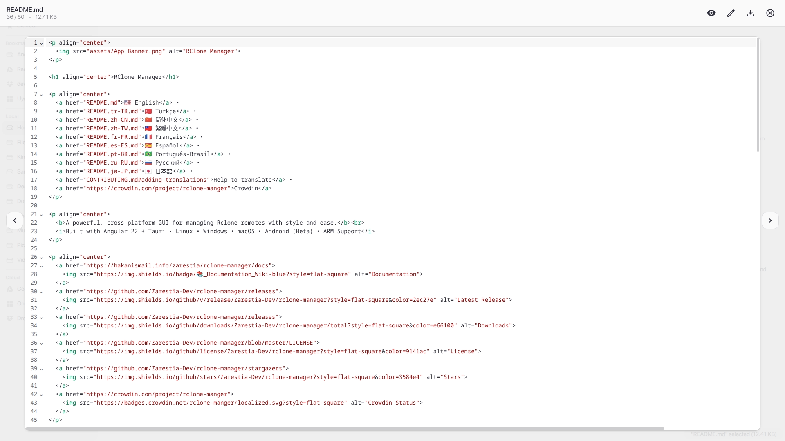

---

## [[icon:settings_remote.primary]] Mounts & Serve Protocol Controls

Turn your cloud storage into local drives or share them across your local network with a single click.

### Mount Control

Mount cloud folders locally onto your file system (using FUSE). Save mount profiles, customize performance flags, and monitor mount statuses in real-time.

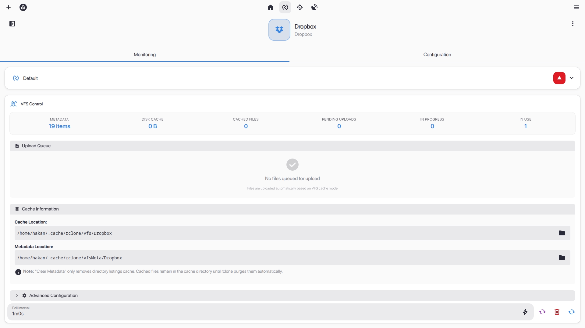

### Serve Control

Instantly host protocols such as **WebDAV**, **SFTP**, **HTTP**, or **FTP** pointing to any folder on your cloud storage. Useful for sharing files or streaming to media centers.

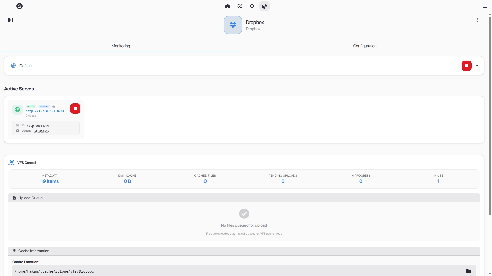

---

## [[icon:track_changes.primary]] Job Monitoring & Transfer Queue

Monitor, analyze, and throttle file transfer operations in real-time.

### Job Watcher

Keep track of all active transfers. View real-time speed charts, estimated remaining time, individual file transfer progress, and adjust global bandwidth limits on the fly to fit your network conditions.

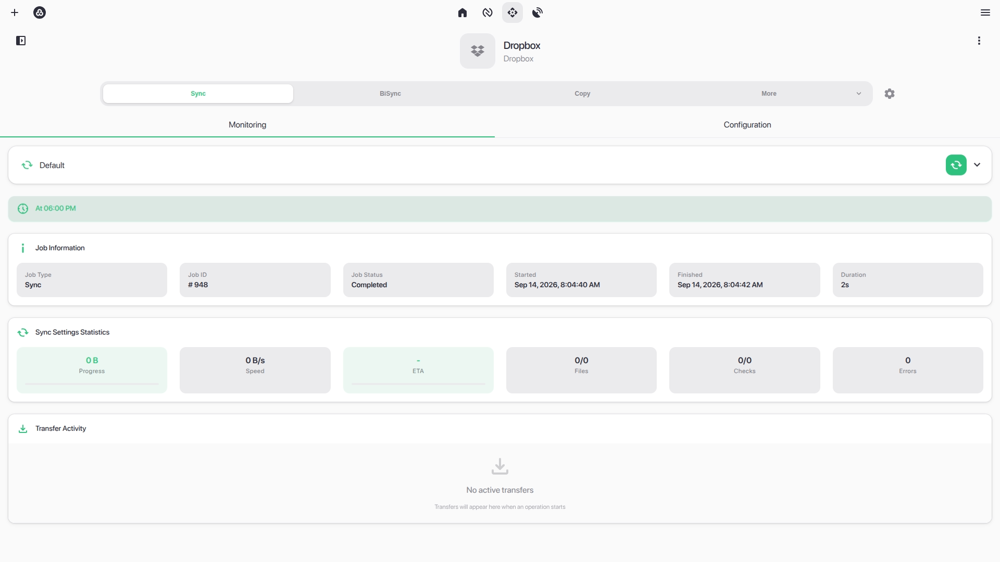

---

## [[icon:keyboard.primary]] Productivity, Power Controls & Safety

Advanced tools designed for power users, automated server deployments, and data security.

### Keyboard Shortcuts Reference

Press `?` or `Ctrl + ?` to display the centralized shortcuts modal, offering instant navigation and file management keybindings. See the full reference in **[Keyboard Shortcuts](../user-guide/keyboard-shortcuts.md)**.

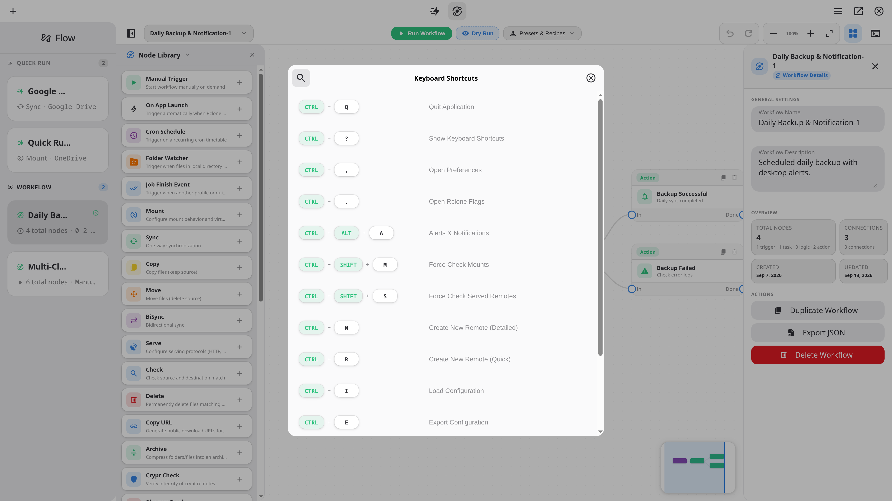

### Power Management & Fast Actions

Long-press the application header to access fast actions: graceful shutdown, backend restart, emergency stop of all running jobs, session lock, and host sleep commands.

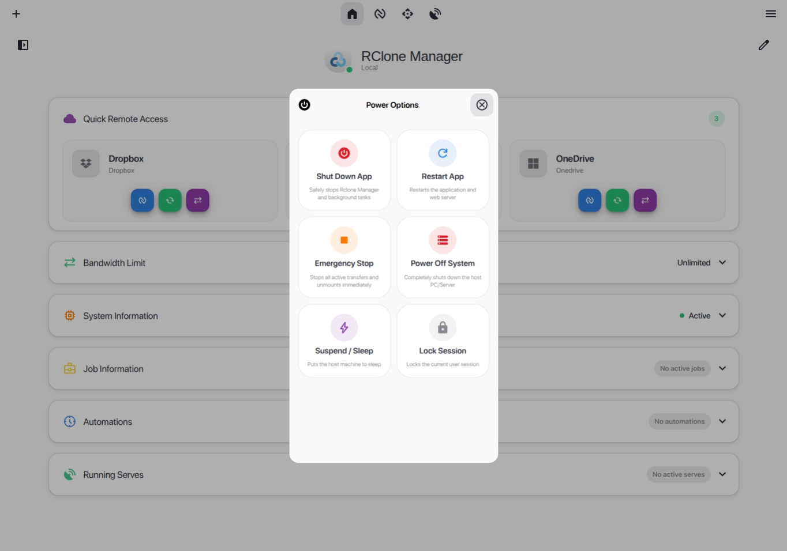

### Configuration Export & Encrypted Vault

Export your remotes, workflows, quick runs, and application settings with optional AES-256 password encryption via the `rcman` core library.

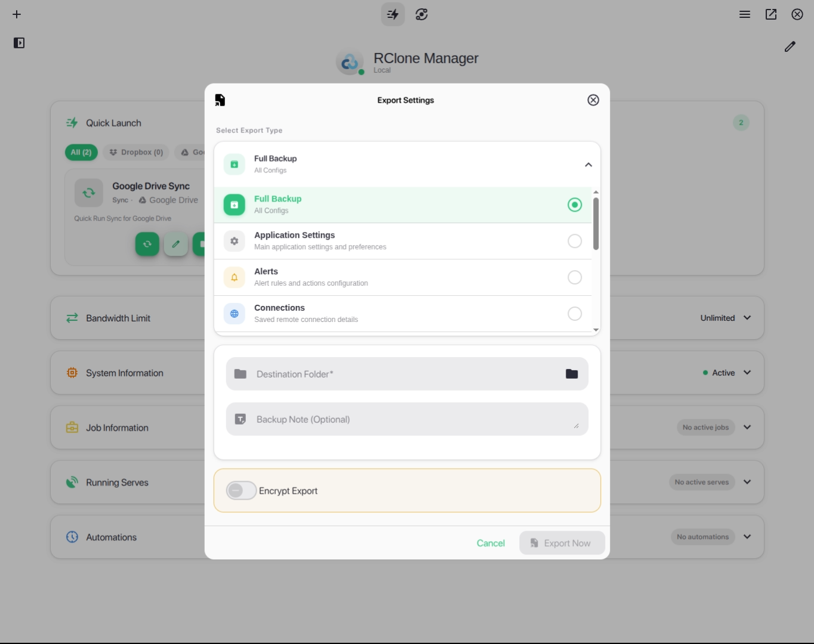
