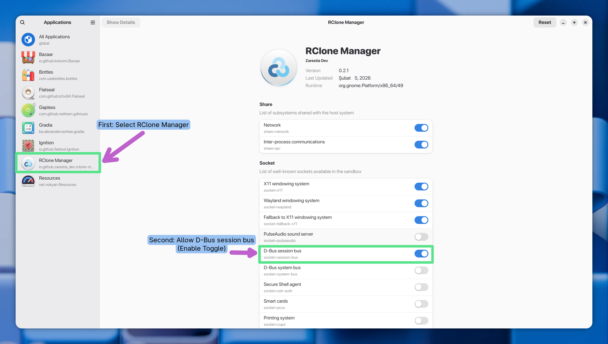
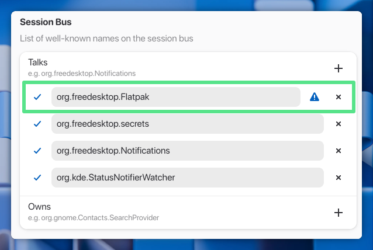

# [[icon:troubleshoot.primary]] Troubleshooting on Linux

Having trouble? Start here, find your symptom below and jump straight to the fix.

---

## [[icon:search.accent]] What's happening?

| I'm seeing this…                                              | Go to                 |
| ------------------------------------------------------------- | --------------------- |
| App won't open, shows a blank window, or freezes              | [Issue 1 →](#issue-1) |
| Flatpak version can't mount drives or shows permission errors | [Issue 2 →](#issue-2) |
| Mounting fails with an error about `allow_other`              | [Issue 3 →](#issue-3) |
| App crashes when I click "Show App" after startup             | [Issue 4 →](#issue-4) |

---

## [[icon:bug_report.warn]] Issue 1: App Won't Start, Shows a Blank Screen, or Freezes {#issue-1}

### [[icon:search.accent]] What you might see

- A crash message mentioning `Failed to create GBM buffer`
- A window that opens but is completely blank or frozen
- The app never finishes loading

### [[icon:settings.accent]] What's going on (in plain English)

RClone Manager uses your GPU to render its interface. On some Linux setups, this causes a conflict and the app simply refuses to draw anything. The fix is to tell the app to skip that GPU shortcut, it'll run fine without it.

---

### [[icon:build_circle.success]] Fix it

> [!TIP]
> **Not sure which command to try?**  
> Start with the first one. If it doesn't work, try the second.

**Open a terminal and run:**

```bash
WEBKIT_DISABLE_DMABUF_RENDERER=1 rclone-manager
```

If the app opens normally, great, this is your fix. Now follow the steps below to make it permanent so you don't have to do this every time.

If it still doesn't work, try this alternative instead:

```bash
WEBKIT_DISABLE_COMPOSITING_MODE=1 GDK_BACKEND=x11 rclone-manager
```

---

### [[icon:save.primary]] Make it permanent

Pick the option that matches how you installed RClone Manager:

<details>
<summary>[[icon:desktop_windows]] I installed it normally (downloaded a .deb, .rpm, or AppImage)</summary>

1. Find and open the app shortcut file. It's usually at one of these locations:
   - `/usr/share/applications/RClone Manager.desktop`
   - `~/.local/share/applications/RClone Manager.desktop`

2. Find the line that starts with `Exec=` and replace it with:

```ini
Exec=env WEBKIT_DISABLE_DMABUF_RENDERER=1 rclone-manager
```

3. Save the file and relaunch the app from your app menu. You're done.

</details>

<details>
<summary>[[icon:inventory_2]] I installed it via Flatpak</summary>

1. First, confirm the fix works for you by running:

```bash
flatpak run --env=WEBKIT_DISABLE_DMABUF_RENDERER=1 io.github.zarestia_dev.rclone-manager
```

2. If the app opens correctly, make it permanent with:

```bash
flatpak override --user --env=WEBKIT_DISABLE_DMABUF_RENDERER=1 io.github.zarestia_dev.rclone-manager
```

From now on, the fix applies automatically every time you launch the app.

</details>

---

## [[icon:lock.warn]] Issue 2: Flatpak Version Can't Mount Drives {#issue-2}

### [[icon:search.accent]] What you might see

- Mounting a drive does nothing or shows a permission error
- The "Start on Login" feature doesn't work

### [[icon:settings.accent]] What's going on (in plain English)

The Flatpak version of RClone Manager runs in a sandbox, it's intentionally restricted from touching most of your system. Some features (like mounting drives) need you to manually grant extra access. This is a one-time setup.

---

### [[icon:build_circle.success]] Fix it

> [!TIP]
> **Recommended: use Flatseal**  
> It's a simple visual app that lets you manage these permissions without touching the terminal.

**Step 1: Install Flatseal:**

```bash
flatpak install flathub com.github.tchx84.Flatseal
```

**Step 2: Open Flatseal and select "RClone Manager" from the list.**

**Step 3: Grant the permissions you need:**

| I want to…                               | What to enable in Flatseal                             |
| ---------------------------------------- | ------------------------------------------------------ |
| Mount drives                             | Under **Socket**, turn on **D-Bus session bus**        |
| Start the app automatically on login     | Under **Filesystem**, add `~/.config/autostart:create` |
| Mount folders anywhere in my home folder | Under **Filesystem**, add `home`                       |

<p align="center">

</p>

> [!IMPORTANT]
> **If mounting still fails** after enabling D-Bus session bus, go to **Session Bus → Talk** and add `org.freedesktop.Flatpak`.

<p align="center">

</p>

**Step 4: Fully quit RClone Manager.** Right-click the tray icon and choose **Quit**. Just closing the window won't be enough, the app keeps running in the background.

**Step 5: Relaunch the app.** The new permissions are now active.

---

<details>
<summary>[[icon:terminal]] I prefer to use the terminal instead of Flatseal</summary>

Run the commands for the permissions you need:

```bash
# For mounting drives
flatpak override --user io.github.zarestia_dev.rclone-manager --socket=session-bus

# For "Start on Login"
flatpak override --user io.github.zarestia_dev.rclone-manager --filesystem=~/.config/autostart:create

# For full home folder access (only if needed)
flatpak override --user io.github.zarestia_dev.rclone-manager --filesystem=home
```

To check what permissions are currently set:

```bash
flatpak override --user --show io.github.zarestia_dev.rclone-manager
```

</details>

---

## [[icon:block.warn]] Issue 3: Mounting Fails with an "allow_other" Error {#issue-3}

### [[icon:search.accent]] What you might see

```
fusermount: option allow_other only allowed if 'user_allow_other' is set in /etc/fuse.conf
```

### [[icon:settings.accent]] What's going on (in plain English)

This happens when RClone Manager is configured to share a mounted drive with other programs (like Docker or Plex). By default, Linux blocks this for security reasons. You just need to turn on one setting.

---

### [[icon:build_circle.success]] Fix it

<details>
<summary>[[icon:desktop_windows]] Standard Linux install</summary>

1. Open the FUSE configuration file (this requires your admin/sudo password):

```bash
sudo nano /etc/fuse.conf
```

2. Find the line that reads `#user_allow_other` and remove the `#` at the start, so it looks like this:

```
user_allow_other
```

3. Save with `Ctrl+O`, then `Enter`, then exit with `Ctrl+X`.

4. Try mounting again in RClone Manager, no restart needed.

</details>

---

## [[icon:rocket.primary]] Issue 4: App Crashes When Opened After Startup {#issue-4}

### [[icon:search.accent]] What you might see

- After a reboot, RClone Manager starts silently in the system tray (this is correct)
- Clicking **"Show App"** from the tray causes the app to crash or disappear
- You may see an error mentioning `Protocol error` or `explicit sync`

### [[icon:settings.accent]] What's going on (in plain English)

On some systems (especially KDE with Nvidia graphics), the app needs a specific environment variable set before it launches. The tricky part is that RClone Manager regenerates its own autostart file, so any manual edits get wiped on the next launch. The solutions below work around this.

---

### [[icon:build_circle.success]] Fix it

<details>
<summary>[[icon:desktop_windows]] I installed it normally (not Flatpak)</summary>

**Recommended: set the fix for your whole KDE session**

This approach means you set it once and it always applies, even if the app regenerates its startup file.

1. Run this in a terminal:

```bash
echo 'export WEBKIT_DISABLE_DMABUF_RENDERER=1' > ~/.config/plasma-workspace/env/rclone-manager-fix.sh
chmod +x ~/.config/plasma-workspace/env/rclone-manager-fix.sh
```

2. Restart your computer. The fix is now permanent.

---

**Alternative: lock the autostart file**

If the above doesn't work, you can manually edit the autostart file and prevent the app from overwriting it.

1. Make sure "Start on login" is enabled inside RClone Manager (so it creates the file).
2. Open the file:

```bash
nano ~/.config/autostart/RClone\ Manager.desktop
```

3. Find the `Exec=` line and change it to:

```ini
Exec=env WEBKIT_DISABLE_DMABUF_RENDERER=1 rclone-manager --tray
```

4. Save and exit, then lock the file so the app can't overwrite it:

```bash
chmod -w ~/.config/autostart/RClone\ Manager.desktop
```

> [!NOTE]
> To disable autostart in the future, you'll need to delete this file manually or run `chmod +w` on it first.

</details>

<details>
<summary>[[icon:inventory_2]] I installed it via Flatpak</summary>

Run this command, it applies the fix globally and survives any autostart file rewrites:

```bash
flatpak override --user --env=WEBKIT_DISABLE_DMABUF_RENDERER=1 io.github.zarestia_dev.rclone-manager
```

If that doesn't help, try this X11 fallback instead:

```bash
flatpak override --user \
  --env=GDK_BACKEND=x11 \
  --env=WEBKIT_DISABLE_COMPOSITING_MODE=1 \
  io.github.zarestia_dev.rclone-manager
```

</details>

---

## [[icon:folder.warn]] Issue 5: Accessing System Binaries or Host Paths in Flatpak {#issue-5}

### [[icon:search.accent]] What you might see

- You try to use your system's `rclone` binary (e.g., at `/usr/bin/rclone`) but the app says "Invalid binary".
- You cannot select or find folders that are outside of your Flatpak sandbox, such as your native home directory or other system locations.

### [[icon:settings.accent]] What's going on (in plain English)

Flatpak runs RClone Manager in an isolated sandbox, meaning it cannot see your computer's regular filesystem directly. However, Flatpak exposes your real computer's root filesystem inside a special folder called `/var/run/host`. 

---

### [[icon:build_circle.success]] Fix it

To use any binary or file path from your actual computer, you must prefix the path with `/var/run/host`.

**1. Using the System's Rclone Binary**
If you installed `rclone` normally via your distro's package manager (which usually puts it at `/usr/bin/rclone`), go to **Settings → Core** in RClone Manager and set the binary path to:
```text
/var/run/host/usr/bin/rclone
```

**2. Reconfiguring Other Paths (Cache, Logs, Data, etc.)**
Because the sandbox environment separates your files, if you want your RClone Manager configurations, caches, or logs to be saved natively in your actual host's home folder instead of the sandbox, you need to reconfigure those paths as well!

When selecting or typing paths in the app's settings, you must navigate through `/var/run/host` to reach your real directories. For example, your real home folder is located at:
```text
/var/run/host/home/your_username
```

> [!TIP]
> If you just want standard access to your `~` (home) directory without manually typing prefix paths for everything, you can simply grant the app full home access via Flatseal or the terminal (`flatpak override --user --filesystem=home io.github.zarestia_dev.rclone-manager`) as described in [Issue 2](#issue-2).

---

## [[icon:menu_book.accent]] Still stuck?

If none of the above worked, you're not alone, Linux environments vary a lot. Open a bug report on **[GitHub Issues](https://github.com/zarestia-dev/rclone-manager/issues)** and include:

- Your Linux distribution (e.g. Ubuntu 24.04, Fedora 41)
- Your desktop environment (e.g. GNOME, KDE Plasma, Hyprland)
- Your graphics card and driver version
- How you installed RClone Manager (native, AppImage, or Flatpak)

This helps pinpoint the issue much faster.
