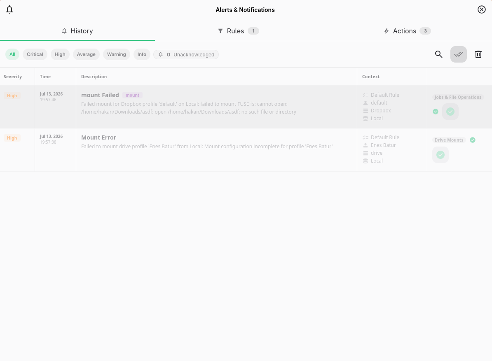
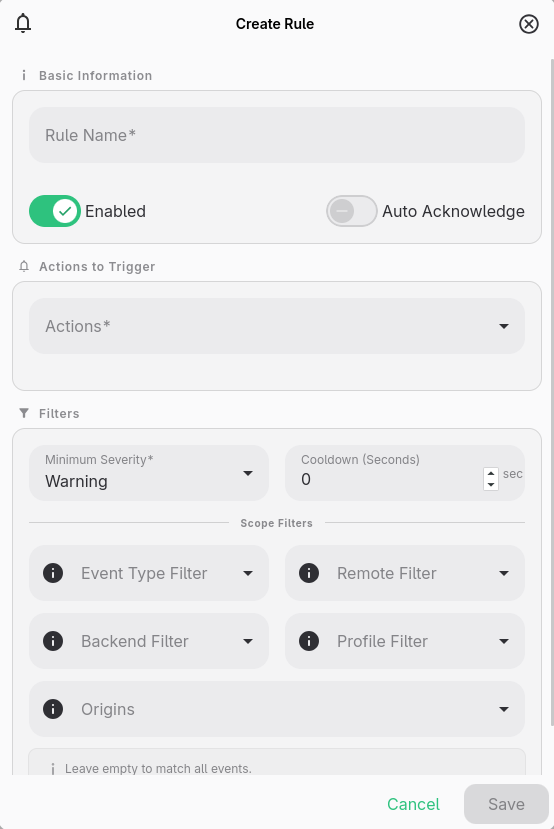
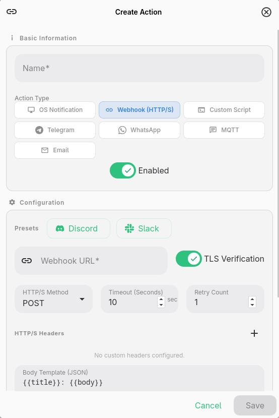

# Alerts & Notifications (Rule-Based Alert System)

RClone Manager features a powerful, event-driven **Alert & Notification System**. Unlike basic desktop popups, it allows you to define flexible trigger rules, filter events by severity or source, and dispatch alerts across multiple notification channels, including **WhatsApp**, **Telegram** (Bot API and Bot-less), **Webhooks**, **MQTT**, **Email**, **Custom Scripts**, and **OS System Notifications**.

---



---

## [[icon:notifications.primary]] Overview & Architecture

The Alert System operates independently of OS toast settings. When background operations, manual transfers, or system events occur, the alert engine evaluates active **Alert Rules**. If an event matches a rule's filter criteria and passes cooldown checks, the rule fires and dispatches all assigned **Alert Actions** in parallel.

### Key Features

- **Multi-Channel Dispatching**: Deliver alerts to multiple services simultaneously (e.g., desktop notification + Telegram message + Webhook payload).
- **Bot-less Messaging**: Send WhatsApp and Telegram alerts via CallMeBot without setting up official bot tokens or enterprise accounts.
- **Granular Event Filtering**: Filter triggers by event type, minimum severity level, specific remote, backend type, profile name, or origin source.
- **Rate Controls**: Prevent notification spam using rule-level **Cooldowns** and **Max Fire Counts**.
- **Template Engine**: Customize message formats using Handlebars dynamic placeholders.
- **History & Action Testing**: Track unacknowledged alerts and test individual action channels with one click (▶️).

---

## [[icon:label.primary]] Event Types & Severity Levels

### Event Severity Levels

Alerts are categorized into five severity levels, ordered from lowest to highest:

| Severity       | Code | Level           | Typical Use Cases                                        |
| :------------- | :--: | :-------------- | :------------------------------------------------------- |
| **`Info`**     | `1`  | Informational   | Job started, server started, update downloaded           |
| **`Warning`**  | `2`  | Low Priority    | Job stopped, non-critical retry, minor warning           |
| **`Average`**  | `3`  | Medium Priority | Routine job completed, serve closed                      |
| **`High`**     | `4`  | High Priority   | Transfer error, job execution failed, server start error |
| **`Critical`** | `5`  | Emergency       | Backend connection lost, engine failure, auth failure    |

### Event Kinds

Rules can target all events or filter by specific **Event Kinds**:

- **`job`**: Manual file transfers and background rclone tasks (Sync, Copy, Move, Delete, Check, CryptCheck).
- **`serve`**: Background protocol servers (`WebDAV`, `DLNA`, `HTTP`, `FTP`, `SFTP`).
- **`mount`**: FUSE drive mount and unmount operations.
- **`engine`**: Core rclone engine status, backend connectivity, and binary lifecycle.
- **`update`**: Application updates and rclone binary upgrades.
- **`automation`**: Scheduled tasks and real-time directory watcher events.
- **`system`**: Application startup, shutdown, and system events.
- **`export`**: Credential, profile, and settings export operations.

---

## [[icon:tune.primary]] Configuring Alert Rules

An **Alert Rule** connects events to actions: _"When an event fires matching these filters $\rightarrow$ execute these actions."_



### Rule Configuration Fields

- **`Name`**: Descriptive name for the rule (e.g., _"Notify High Failures on Backup Remote"_).
- **`Enabled`**: Toggle rule active state on/off.
- **`Event Filter`**: Select specific event kinds (`job`, `mount`, `serve`, etc.). Leave empty to match all event kinds.
- **`Minimum Severity`**: Set the threshold (e.g., `High`). Events below this severity will be ignored.
- **`Scope Filters`**:
  - **Remote Filter**: Match specific remotes (e.g., `gdrive:`, `s3-backup:`).
  - **Backend Filter**: Match specific backend storage providers (e.g., `drive`, `s3`, `local`).
  - **Profile Filter**: Match specific operation profiles.
  - **Origin Filter**: Match event origins (`Dashboard`, `Automation`, `File Manager`, `Startup`, `Update`, `Internal`).
  - **Body Contains**: Case-sensitive substring filter on the alert message body.
- **`Cooldown (Seconds)`**: Minimum duration required between rule firings. Prevents double-firing during concurrent or rapid events (e.g. `60` seconds).
- **`Max Firings`**: Maximum times the rule can trigger (`0` = unlimited).
- **`Auto Acknowledge`**: Automatically mark fired alerts as acknowledged in history.
- **`Actions`**: List of Action IDs to execute when the rule matches.

---

## [[icon:send.primary]] Alert Action Channels

RClone Manager supports 7 distinct action types. You can create multiple actions and attach them to any number of rules.



---

### 1. [[icon:desktop_windows.primary]] System Notification (OS Toast)

Delivers native desktop notifications using your operating system's built-in notification system (`tauri-plugin-notification`).

- **Configuration**: No setup required. Uses standard desktop toast notifications.
- **Toggled state**: Automatically syncs with the application's `general.notifications` setting.

---

### 2. [[icon:smart_toy.primary]] Telegram

Supports both official Telegram Bot API messaging and **Bot-less** CallMeBot notifications.

#### Mode A: Bot API (`bot`)

Sends notifications through an official Telegram Bot.

- **`Bot Token`**: Obtain your bot token from Telegram's **`@BotFather`** (e.g., `123456789:ABCdefGhIJKlmNoPQ...`).
- **`Chat ID`**: Your personal Chat ID or Group Chat ID (obtain via **`@userinfobot`** or group ID `-100...`).

#### Mode B: Bot-less Telegram (`botless`)

Sends alerts directly to your Telegram `@username` using the CallMeBot gateway without requiring a bot token.

- **`Username / Chat ID`**: Your Telegram username (e.g., `@myusername`).
- **One-time Setup**: Open Telegram, search for **`@CallMeBot_txtbot`**, and send **`/start`** to authorize CallMeBot.

---

### 3. [[icon:chat.primary]] WhatsApp

Delivers WhatsApp push notifications directly to your phone.

#### Provider A: CallMeBot (`callmebot`)

Bot-less personal WhatsApp notifications using CallMeBot gateway.

- **`Phone Number`**: Full phone number with country code (e.g., `+34644179464` or `+1234567890`).
- **`API Key`**: CallMeBot API Key.
- **One-time Setup Instructions**:
  1. Add **`+34 644 17 94 64`** to your phone contacts as **CallMeBot**.
  2. Send the message **`I allow callmebot to send me messages`** to that contact on WhatsApp.
  3. CallMeBot will reply immediately with your personal **API Key**.

#### Provider B: Custom Gateway (`custom_gateway`)

Forward WhatsApp alerts through your custom HTTP gateway service or enterprise webhook bridge.

- **`Phone Number`**: Recipient phone number.
- **`Gateway URL`**: Full URL endpoint of your custom WhatsApp gateway.

---

### 4. [[icon:webhook.primary]] Webhook (HTTP/S)

Sends custom HTTP/S requests to webhooks like Discord, Slack, Home Assistant, or custom API endpoints.

- **`URL`**: Target HTTP/S endpoint.
- **`Method`**: `POST`, `GET`, or `PUT`.
- **`Headers`**: Key-value pairs for HTTP headers (e.g., `Authorization: Bearer <token>`, `Content-Type: application/json`).
- **`TLS Verification`**: Toggle TLS certificate validation.
- **`Presets`**: One-click configuration templates for **Discord** and **Slack**:
  - **Discord Preset**: Formats payload into rich embeds with severity colors.
  - **Slack Preset**: Formats payload into Slack block/text JSON.

---

### 5. [[icon:terminal.primary]] Custom Script

Executes a local shell script or binary (`.sh`, `.bat`, `.ps1`, `.py`) when triggered.

- **`Command`**: Absolute path to executable script (e.g., `/usr/local/bin/notify.sh`). Use the **Browse** button to pick a file.
- **`Arguments`**: Space-separated command line arguments.
- **`Environment Variables`**: The alert engine automatically injects event metadata as environment variables:

```bash
ALERT_TITLE="Sync Completed"
ALERT_BODY="Successfully synced gdrive:backup to local /mnt/data"
ALERT_SEVERITY="info"
ALERT_SEVERITY_CODE="1"
ALERT_EVENT_KIND="job"
ALERT_REMOTE="gdrive:"
ALERT_PROFILE="DailyBackup"
ALERT_BACKEND="drive"
ALERT_OPERATION="Sync"
ALERT_ORIGIN="Automation"
ALERT_TIMESTAMP="2026-07-13T09:00:00Z"
ALERT_RULE_NAME="Backup Alerts"
ALERT_SOURCE="/mnt/data"
ALERT_DESTINATION="gdrive:backup"
```

---

### 6. [[icon:sensors.primary]] MQTT

Publishes alert payloads to an MQTT broker for smart home platforms (Home Assistant, Node-RED, OpenHAB) or IoT dashboards.

- **`Host` & `Port`**: MQTT broker address (default `localhost:1883`, or `8883` for TLS).
- **`Use TLS`**: Enable encrypted TLS connection.
- **`Topic`**: MQTT topic path (e.g. `rclone/alerts/job_failed`).
- **`QoS`**: Quality of Service level (`0` = At most once, `1` = At least once, `2` = Exactly once).
- **`Retain`**: Set MQTT retain flag on published messages.
- **`Username` & `Password`**: Optional broker authentication.

---

### 7. [[icon:email.primary]] Email (SMTP)

Sends formatted email notifications via an SMTP mail server.

- **`SMTP Server` & `Port`**: Outgoing mail server (e.g. `smtp.gmail.com:587`).
- **`Encryption`**: `None`, `TLS` (Port 465), or `StartTLS` (Port 587).
- **`From` & `To`**: Sender and recipient email addresses.
- **`Subject Template`**: Custom email subject with Handlebars placeholders.
- **`Body Template`**: Custom plain text or HTML email body.

---

## [[icon:code.primary]] Message Templates & Handlebars Variables

Text payloads for Webhooks, Telegram, WhatsApp, MQTT, and Email support **Handlebars placeholders**. They are evaluated at runtime with real-time event details:

| Variable                | Description                | Example Output                                              |
| :---------------------- | :------------------------- | :---------------------------------------------------------- |
| **`{{title}}`**         | Event summary title        | `Sync Process Started`                                      |
| **`{{body}}`**          | Detailed event description | `Failed to mount gdrive profile 'Work': connection refused` |
| **`{{severity}}`**      | Severity level name        | `critical`, `high`, `warning`, `info`                       |
| **`{{severity_code}}`** | Numeric severity code      | `5`                                                         |
| **`{{event_kind}}`**    | Class of event             | `job`, `serve`, `mount`, `engine`, `automation`             |
| **`{{remote}}`**        | Target remote name         | `gdrive:`                                                   |
| **`{{profile}}`**       | Target operation profile   | `BackupProfile`                                             |
| **`{{backend}}`**       | Storage backend type       | `drive`, `s3`, `local`                                      |
| **`{{operation}}`**     | Rclone operation name      | `Sync`, `Copy`, `Move`, `Check`                             |
| **`{{origin}}`**        | Trigger origin source      | `Dashboard`, `Automation`, `Filemanager`                    |
| **`{{source}}`**        | Source path or endpoint    | `/home/user/documents`                                      |
| **`{{destination}}`**   | Destination path           | `gdrive:documents`                                          |
| **`{{timestamp}}`**     | ISO-8601 event timestamp   | `2026-07-13T09:00:00+03:00`                                 |
| **`{{rule_name}}`**     | Matching rule name         | `Critical Errors Rule`                                      |

---

## [[icon:history.primary]] Alert History & Testing Actions

### Managing Alert History

- **Unacknowledged Badge**: Displays an unacknowledged counter in the application sidebar and titlebar when new alerts fire.
- **Acknowledge All**: Mark all history entries as read with one click.
- **Filter History**: Filter past alerts by severity, event kind, remote, profile, origin, or acknowledgment status.
- **Clear History**: Purge old alert logs.

### Testing Action Channels

Before assigning an action to a rule, click the **Play / Test** button (▶️) next to the action in the **Actions** table. The system will dispatch a test event payload to verify endpoint connectivity, authentication keys, or script execution immediately.
