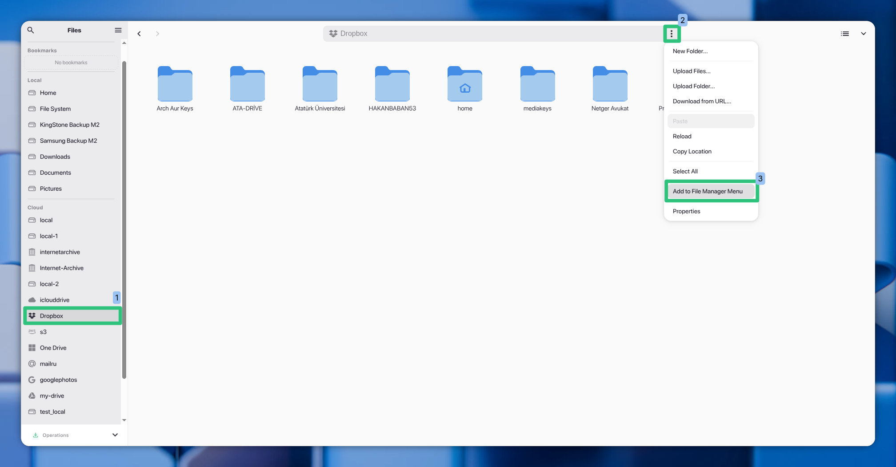

# [[icon:extension.primary]] File Manager Integrations

RClone Manager provides native file manager integrations across Windows, Linux, and macOS. This allows you to right-click files or folders in your system's file manager and upload them directly to a configured cloud remote in the background.

---

## [[icon:settings.primary]] Context Menu Integration

You can register or unregister context menu integrations directly from the **File Browser** in the RClone Manager GUI.

### How to Register a Remote Integration

To register the integration for a specific remote folder:

1. **Select the Remote (1)**: In RClone Manager's built-in File Browser, select the target remote from the **Cloud** list on the left sidebar (e.g., **Dropbox**).
2. **Open Path Options (2)**: Navigate to the target folder, and click the vertical 3-dots icon on the right side of the path bar at the top (or right-click the empty area in the file browser pane).
3. **Register (3)**: Select **"Add to File Manager Menu"** from the dropdown menu.



To unregister and clean up the context menu actions for a path:
- Open the path options menu (3-dots or right-click) at the registered path and select **"Remove from File Manager Menu"**.


> [!NOTE]
> **Automatic Cleanup**: When RClone Manager is uninstalled or removed from the system, all of these registered context menu actions, extensions, and shell scripts are automatically cleaned up, leaving zero residue on your filesystem.

### Windows (Windows Explorer)
RClone Manager creates two types of context menu shortcuts:
1. **Cascading Right-Click Submenu**: Adds an **"RClone Manager"** cascading submenu directly in your first-level context menu (under *Show more options* on Windows 11). Hovering over it displays **"Upload to [Remote]"** with the custom RClone Manager icon.
2. **Send To Shortcut**: Adds a shortcut inside your `%APPDATA%\Microsoft\Windows\SendTo` directory. This is useful for bulk-sending multiple selected files into a single queue.

### Linux (Nautilus, Dolphin, Nemo)
RClone Manager integrates with the most popular Linux file managers:
- **KDE Dolphin**: Registers service menus under `~/.local/share/kio/servicemenus/` as desktop actions, showing up directly in your right-click menu.
- **Nautilus (GNOME)**: Installs a Python extension (`MenuProvider`) in `~/.local/share/nautilus-python/extensions/` to add native context-menu options, along with a fallback shell script in `~/.local/share/nautilus/scripts/`.
- **Nemo (Cinnamon)**: Adds custom Nemo actions in `~/.local/share/nemo/actions/`.

> [!NOTE]
> All Linux context menu desktop and script templates automatically support system localization and are marked with execution permissions (`0o755`) to prevent security warning prompts.

> [!IMPORTANT]
> **Flatpak Users**: If you are using the Flatpak version of RClone Manager and want to use the Context Menu Integration, you must grant the application access to your home directory. This is required both to write the integration files (extensions, scripts) to your host user directory and for the application to access files to upload when triggered from the context menu:
> ```bash
> flatpak override --user io.github.zarestia_dev.rclone-manager --filesystem=home
> ```
> *(Or enable the **Home folder** permission under **Filesystem** in Flatseal).*

### macOS (Finder)
Registers a Finder Quick Action (Service) bundle in `~/Library/Services/` using Automator zsh-action workflows. You can trigger it from Finder's **Quick Actions** menu.

---

## [[icon:delete.primary]] Uninstallation Clean-up

RClone Manager takes care of your filesystem and leaves zero residue:
- **Windows**: The installer (both NSIS `.exe` and WiX `.msi` packages) automatically cleans up all custom registry keys and `.lnk` shortcuts from your SendTo folder upon uninstallation.
- **Linux**: The system packages (DEB/RPM) run a pre-removal script (`preremove.sh`) to delete all registered context menu actions, python extensions, and shell scripts across all system user home folders.
- **macOS**: Dragging the app to the Trash does not automatically clean user service bundles, but clicking **Unregister** inside the app GUI will completely remove the `.workflow` folders.