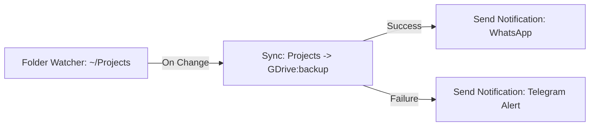
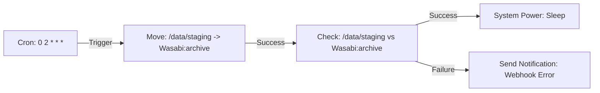
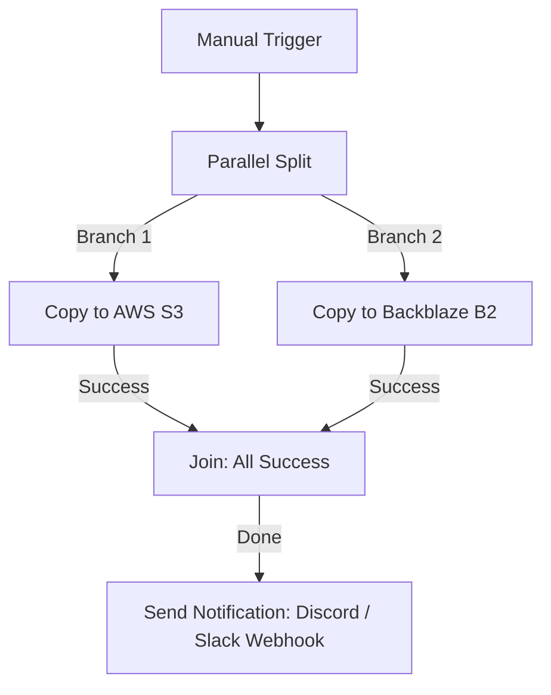

# [[icon:account_tree.primary]] Visual Workflow Automation

RClone Manager features a visual node-based workflow editor in the **Flow** workspace. It allows you to design, schedule, execute, and monitor automated cloud pipelines using an interactive canvas.

Instead of writing complex shell scripts or manual cron jobs, you can drag and drop triggers, transfer tasks, branching logic, and notification actions, wire them together with Bezier connection lines, and monitor their execution in real-time.

---

## [[icon:brush.primary]] The Workflow Canvas

  

The visual canvas provides a complete workspace for building multi-step automation pipelines:

- **Infinite Canvas with Pan & Zoom:** Freely pan around your workflow with mouse drag or touchpad gestures, and zoom smoothly between 25% and 200%.
- **Interactive Minimap:** A live navigation minimap in the bottom-right corner provides an instant bird's-eye view of your entire pipeline and allows single-click navigation to distant nodes.
- **Node Palette:** A searchable sidebar categorized by node type (Triggers, Tasks, Logic, Actions) allows you to drag new nodes directly onto the canvas.
- **Dynamic Connection Wires:** Connect output ports to downstream input ports with interactive Bezier curve cables. Cables visually indicate connection state, execution progress, and signal flow.
- **Node Inspector:** Selecting any node opens a contextual configuration panel on the right sidebar where you can tune operation parameters, paths, retry policies, and conditions.
- **Execution Drawer & Logs:** An expandable drawer at the bottom provides a step-by-step trace of live runs, execution timestamps, duration metrics, and output logs.

---

## [[icon:extension.primary]] Node Types & Anatomy

Every workflow node consists of a **header** (identifying the operation with category-based color styling), a **body** (displaying summarized parameters such as remotes and paths), **input sockets** on the left, and **output sockets** on the right.

### 1. [[icon:bolt.accent]] Triggers

Triggers initiate the workflow execution. A workflow can have one or multiple entry points.

| Trigger Node         | Description                                                                                                                                                                           | Typical Use Case                                                           |
| :------------------- | :------------------------------------------------------------------------------------------------------------------------------------------------------------------------------------ | :------------------------------------------------------------------------- |
| **Manual Trigger**   | Starts the workflow on demand when you click the "Run" button in the canvas or dashboard.                                                                                             | Ad-hoc backups, on-demand sync, manual deployments.                        |
| **On App Launch**    | Automatically fires when RClone Manager starts (with an optional configurable delay).                                                                                                 | Mounting drives on startup, synchronizing desktop configurations.          |
| **Cron Schedule**    | Triggers on a recurring timetable using standard 5-part cron syntax (e.g., `0 2 * * *` for 2:00 AM daily).                                                                            | Nightly backups, weekly archives, hourly sync intervals.                   |
| **Folder Watcher**   | Monitors a local directory for file creation, modification, or deletion events with debouncing and net-change rules (see **[Filters & File Monitoring](filters-and-monitoring.md)**). | Real-time backup of project folders, automatic upload of downloaded files. |
| **Job Finish Event** | Listens for the completion of another background transfer, profile, or Quick Run.                                                                                                     | Chained operations, post-transfer validation or cleanup.                   |

---

### 2. [[icon:task_alt.accent]] Tasks & Operations

Tasks perform actual work using Rclone's core operations or local system utilities. All source and destination paths fully support **[Dynamic Paths & Macros](dynamic-paths.md)** (such as `Backups/$(date)` or `Archives/$(hostname)`). Most task nodes feature standard **Success** and **Failure** output ports, enabling advanced error handling.

| Task Node              | Description                                                                                                                                                   | Configuration Options                                              |
| :--------------------- | :------------------------------------------------------------------------------------------------------------------------------------------------------------ | :----------------------------------------------------------------- |
| **Sync**               | Unidirectional synchronization making destination identical to source.                                                                                        | Source/destination remotes, paths, `--delete-after`, filter rules. |
| **Copy**               | Copies new or modified files from source to destination without deleting files on destination.                                                                | Source/destination remotes, exclude patterns, dry run flag.        |
| **Move**               | Moves files from source to destination, deleting them from the source upon successful verification.                                                           | Source/destination remotes, minimum age, delete empty dirs.        |
| **Bisync**             | Bidirectional synchronization between two paths with conflict resolution.                                                                                     | Path 1, Path 2, `--resync` toggle, conflict resolution strategy.   |
| **Check / Cryptcheck** | Verifies integrity and checksums between source and destination.                                                                                              | Hash type, one-way check, download verification.                   |
| **Mount**              | Mounts a cloud remote or folder to a local directory via FUSE (see **[Mounting Drives](mounting.md)** and **[Template Management](template-management.md)**). | Remote path, local mount point, VFS cache mode, read-only flag.    |
| **Serve**              | Hosts a cloud directory over WebDAV, SFTP, HTTP, or FTP protocols.                                                                                            | Protocol type, bind address, port, authentication credentials.     |
| **Execute Script**     | Executes a local shell script, binary, or command.                                                                                                            | Command line, working directory, arguments, fail-on-error.         |
| **Quick Run**          | Invokes a pre-configured Quick Run preset (see **[Quick Runs](quick-runs.md)**).                                                                              | Target Quick Run ID, override parameters.                          |
| **Rclone RC Command**  | Executes an arbitrary low-level Rclone Remote Control (RC) endpoint.                                                                                          | RC method (e.g., `core/version`, `vfs/refresh`), JSON parameters.  |
| **Cleanup Trash**      | Purges the cloud remote's recycle bin / trash folder.                                                                                                         | Remote identifier, path.                                           |

---

### 3. [[icon:alt_route.accent]] Logic & Flow Control

Logic nodes control execution flow, decision making, and concurrency across the canvas.

| Logic Node           | Description                                                                                                                                   | Configuration                                                                                  |
| :------------------- | :-------------------------------------------------------------------------------------------------------------------------------------------- | :--------------------------------------------------------------------------------------------- |
| **Condition Branch** | Evaluates a test expression (e.g., file existence, return code, variable equality) and routes execution along **True** or **False** branches. | Operator (`equals`, `not_equals`, `greater_than`, `contains`), left/right operands.            |
| **Delay Timer**      | Pauses workflow execution for a specified number of seconds before proceeding to downstream nodes.                                            | Duration in seconds (e.g., wait 30 seconds for remote cache invalidation).                     |
| **Parallel Split**   | Splits execution into multiple downstream branches that execute simultaneously.                                                               | Branch count (Branch 1, Branch 2, etc.).                                                       |
| **Join Branches**    | Waits for parallel branches to converge before continuing downstream.                                                                         | Join Mode: `all_success` (wait for all branches), `any_success` (proceed on first completion). |
| **Stop Workflow**    | Explicitly terminates the workflow with an assigned state (Success, Warning, or Error) and log message.                                       | Status code, terminal status message.                                                          |

---

### 4. [[icon:campaign.accent]] Actions & System Control

Action nodes handle external communication and system power operations upon pipeline completion.

| Action Node           | Description                                                                                                                                                                            | Channels / Targets                                                                                             |
| :-------------------- | :------------------------------------------------------------------------------------------------------------------------------------------------------------------------------------- | :------------------------------------------------------------------------------------------------------------- |
| **Send Notification** | Dispatches a structured alert message with customizable severity (Info, Success, Warning, Error) via channels configured in **[Alerts & Notifications](alerts-and-notifications.md)**. | **Telegram**, **WhatsApp**, **Generic Webhook**, **Email (SMTP)**, **MQTT**, and **Desktop OS Notifications**. |
| **Unmount Remote**    | Safely unmounts an active cloud drive.                                                                                                                                                 | Target node reference or explicit local mount point.                                                           |
| **Stop Serve**        | Halts an active WebDAV, SFTP, or HTTP server instance.                                                                                                                                 | Target serve node or server identifier.                                                                        |
| **System Power**      | Initiates system power events after backups finish (see **[Power Management & Safety](power-management.md)**).                                                                         | **System Sleep**, **Screen Lock**, or **System Shutdown**.                                                     |
| **Audit Log**         | Appends a custom diagnostic entry into the execution ledger.                                                                                                                           | Severity level, structured message payload.                                                                    |

---

## [[icon:auto_stories.primary]] Common Workflow Recipes

### Recipe 1: Real-Time Directory Watcher & Notification

Keep a local projects folder continuously backed up to Google Drive and receive a notification on WhatsApp whenever an upload completes:

### Recipe 2: Nightly Archive, Checksum Verification & Sleep

Run an encrypted archive job at 2:00 AM every night, verify data integrity, and put the host system to sleep to conserve power:

### Recipe 3: Multi-Cloud Redundancy via Parallel Split

Upload mission-critical database dumps to two separate cloud providers simultaneously and notify your DevOps channel once both finish:

---

## [[icon:sync.primary]] Live Execution & Monitoring

When you click **Run Workflow** on the canvas toolbar:

1. **Active Highlighting:** Nodes currently executing illuminate with an active pulsing border, while completed nodes show green checkmarks and failed nodes show red warnings.
2. **Execution Drawer:** Click the chevron bar at the bottom of the canvas to open the Execution Drawer. It reveals:
   - Total run time and per-node duration metrics.
   - Live stdout/stderr output from transfer processes and script nodes.
   - Raw input and output JSON payloads passed between connected nodes.
3. **Execution History:** View past runs, including timestamp, duration, status, and historical logs.

---

## [[icon:file_download.primary]] Exporting & Importing Workflows

Workflows are stored as declarative JSON schemas:

- **Export:** Click the **Export** button in the canvas toolbar to download your complete pipeline as a `.json` workflow recipe.
- **Import:** Click **Import Workflow** to load recipes shared by teammates or imported from other systems.
- **Portability:** Workflows use standardized remote and credential references, making them safe to transfer between desktop installations and headless server instances.

---

### Related Documentation

- [Quick Runs](quick-runs.md)
- [Keyboard Shortcuts](keyboard-shortcuts.md)
- [Dynamic Paths & Macros](dynamic-paths.md)
- [Filters & File Monitoring](filters-and-monitoring.md)
- [Alerts & Notifications](alerts-and-notifications.md)
- [Power Management & Safety](power-management.md)
